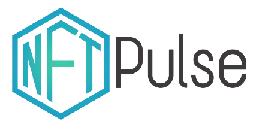

    

    NFTPulse is a advanced web tool to check NFT status.

## 🚀 Deployment
NFTPulse.org is deployed through the GitHub Pages service.

## 🔨 Builded with
* HTML

Yes, just for now.

## 🤲 Contributing
Do you would like to contribute? Do you want to be the author of a new feature? Awesome! please fork the repository and make changes as you like. [Pull requests](https://github.com/360macky/NFTPulse/pulls) are warmly welcome.

## ✒️ Authors/Developers
* **[Marcelo Arias](https://github.com/360macky)**, in charge of linking to GitHub, site deployment, and the very simple first page of NFTpulse.
* **[Elvis Nolasco](https://github.com/ensout)**, (yes, finally weee), uploaded the first NFTPulse logo and hooked it to the first page

> 💡 **Also:** The main idea for NFTPulse.org was conceptualized and is currently guided by Elvis Nolasco.

## 📃 License
Distributed under the GPL-3.0 License.
See [`LICENSE`](./LICENSE) for more information.
